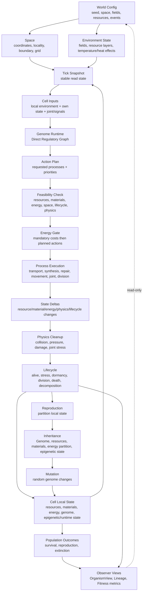

---
tags:
  - alife
  - worklog/report
---

# REPORT: gray-zone graph prototype

Date: 2026-06-30 00:38

## Goal

Побудувати логічний ланцюг / граф-прототип вимог, який допомагає знаходити сірі зони до створення моделі класів, об'єктів або ECS-компонентів.

Це не модель реалізації. Це причинний граф вимог: які стани існують, які переходи між ними потрібні, де потрібні правила, формули або контракти.

## Prototype Graph

## Reading the Graph

У цьому графі кожен вузол має мати контракт:

- що він читає;
- що він може змінити;
- коли зміна стає видимою;
- які величини мають одиниці, межі та default;
- що відбувається при failure;
- які дані потрібні для debug/trace.

Якщо для ребра між двома вузлами немає такого контракту, це сіра зона.

## Main Gray Zones

### GZ-01. Units and scales

Не вистачає єдиної шкали для `amount`, `volume`, `density`, `Energy`, `temperature`, `field value`, `diffusion_rate`, `tick_duration`.

Наслідок: неможливо стабільно підібрати конфіги, порівнювати cost процесів і оцінювати, чи клітина взагалі може жити.

Органічне заповнення:

- створити окремий `docs/world/units.md` або розділ у `docs/GLOSSARY.md`;
- визначити умовні одиниці без прив'язки до реального SI;
- зафіксувати invariant: усі formulas і config bounds використовують ці одиниці.

Варіанти:

- simple normalized units: усе в `0..1` або малих умовних числах;
- simulation units: amount/volume/energy мають незалежні шкали;
- hybrid: normalized для fields/signals, simulation units для matter/energy.

### GZ-02. Tick-to-Scheduler semantic contract

Tick описаний як час світу, Scheduler як оптимізація рушія, але ще не зафіксовано повний набір semantic invariants.

Наслідок: реалізація може випадково змінити причинність світу через порядок Systems.

Органічне заповнення:

- додати документ або секцію `Tick Semantics Contract`;
- описати read snapshot, write buffer, same-tick visibility, deterministic tie-breaking;
- заборонити поведінкову залежність від порядку ітерації.

Варіанти:

- строгий double-buffer per Tick;
- phased buffers per stage;
- event/delta buffer з commit наприкінці Tick.

### GZ-03. Feasibility Check is named but not fully specified

Feasibility Check присутній у багатьох документах, але немає єдиного contract: input, output, failure reason, side effects, interaction with process progress.

Наслідок: кожен процес може почати мати власну приховану логіку дозволу.

Органічне заповнення:

- створити `docs/biology/feasibility.md` або секцію в `biology/processes.md`;
- визначити результат як `allowed/rejected + reasons + required_costs + blocked_by`;
- зафіксувати, що rejected planned action не має часткового результату.

Варіанти:

- binary feasibility only;
- feasibility + graded diagnostics;
- feasibility + reservation model для ресурсів і Energy.

### GZ-04. Mandatory costs vs planned actions

Прийняте правило є: mandatory costs списуються першими, planned actions не виконуються, якщо Energy не вистачає на весь набір. Але не визначено, що саме mandatory, а що planned.

Наслідок: maintenance, joint upkeep, genome copying, repair preparation можуть потрапити в різні категорії в різних реалізаціях.

Органічне заповнення:

- створити таблицю process taxonomy:
  `passive`, `mandatory upkeep`, `planned active action`, `long-running preparation`, `cleanup`;
- для кожної категорії визначити cost timing і failure mode.

Варіанти:

- мінімалістично: mandatory тільки material upkeep / boundary upkeep;
- ширше: mandatory включає Joint upkeep і genome stability;
- консервативно: усе, що не survival upkeep, є planned.

### GZ-05. Process progress vs action execution

Документація вже відділяє long-running progress від partial execution, але правила накопичення progress ще не визначені.

Наслідок: synthesis, repair, genome copying і division preparation можуть поводитися як миттєві дії або як накопичувані процеси без загальної логіки.

Органічне заповнення:

- визначити `ProcessProgress` як state, який може існувати між Tick;
- progress змінюється тільки через allowed planned action або passive/mandatory mechanism;
- rejected action не збільшує progress.

Варіанти:

- progress per process type;
- progress as material/runtime state;
- no progress у базовій smoke-моделі, тільки atomic actions.

### GZ-06. Minimal viable cell formula

Є описані умови життя, смерті, maintenance, damage, але немає формули мінімальної життєздатності.

Наслідок: неможливо стабільно відповісти, чи виживе одна клітина в seed-сценарії.

Органічне заповнення:

- описати `viability check` як набір необхідних умов:
  boundary, critical materials, energy production or reserve, free capacity, genome/regulatory carrier, degradation compensation;
- розділити `alive`, `stressed`, `dormant`, `non-viable`, `dead`.

Варіанти:

- hard threshold для базової моделі;
- weighted viability score тільки для observer/debug;
- rule-based state machine без єдиного score.

### GZ-07. Division partition rules

Уточнено, що Energy Buffer при поділі є partition локального стану. Але немає загальних partition functions для resources, materials, genome, epigenetics, damage, joints.

Наслідок: reproduction не можна перевірити на conservation і determinism.

Органічне заповнення:

- описати division як physical split + partition contract;
- для кожного state type визначити partition strategy, noise, bounds, conservation rule;
- окремо визначити failed division before/after partition.

Варіанти:

- proportional by volume;
- spatial split by local position;
- regulated asymmetric split;
- noisy proportional split для базової моделі.

### GZ-08. Direct Regulatory Graph interface boundaries

Direct Regulatory Graph прийнятий як базова модель, але межі входів/виходів ще широкі: activation functions, cycles, output scales, priority semantics, energy cost.

Наслідок: Genome Runtime може стати або занадто слабким, або прихованим behavioral script engine.

Органічне заповнення:

- зафіксувати minimal input/output vocabulary;
- визначити signal normalization і output priority scale;
- описати mapping `Genome output -> ActionPlan`, а не напряму `Genome output -> world mutation`.

Варіанти:

- DAG only;
- bounded recurrent graph with fixed runtime steps;
- graph with memory only через epigenetic/runtime state.

### GZ-09. Materials-to-process capability matrix

Принцип каже, що materials визначають function, але немає повної матриці: який material property дозволяє який process.

Наслідок: можна випадково додати process, який працює без матеріальної основи.

Органічне заповнення:

- створити capability matrix:
  `property -> enables process -> required resources -> energy cost -> degradation risk`;
- заборонити process без матеріального механізму.

Варіанти:

- одна таблиця в `world/materials.md`;
- process-centric таблиця в `biology/processes.md`;
- config-driven matrix у `materials_config.md` з Canon-правилами.

### GZ-10. Resource reaction model

Є properties, reaction_profile, energy_value, phase, toxicity-through-reaction, але немає мінімальної reaction semantics.

Наслідок: Energy production, poisoning-by-reaction, degradation і resource cycles не можна зробити стабільними.

Органічне заповнення:

- описати reaction as `inputs + conditions + catalyst/material + products + heat + probability/rate`;
- відділити passive reactions від controlled reactions.

Варіанти:

- deterministic lookup table;
- simple mass-action-like rates;
- threshold reactions for базова модель.

### GZ-11. Heat / temperature boundary

Базова модель каже: cell has temperature, Heat transfers by contact/Joint, global Heat field future. Але config docs ще мають Heat Field як можливу конфігурацію.

Наслідок: можна неявно повернути глобальний Heat field у базову модель.

Органічне заповнення:

- явно розділити `temperature` як local state і `HeatField` як future/optional field model;
- у config docs позначити Heat Field як optional/future або scenario extension.

Варіанти:

- no Heat field in base;
- local neighbor heat transfer only;
- Heat as derived field for observer/rendering, not behavior input.

### GZ-12. Space representation and locality

Space описаний добре, але ще відкриті grid size, resource representation, field representation, boundary changes, zones.

Наслідок: неможливо гарантувати однакову локальність для resources, fields, cells, joints і traces.

Органічне заповнення:

- визначити один locality contract:
  `position -> neighborhood -> readable local state -> interaction candidates`;
- для кожної сутності вказати, чи вона grid-based, entity-based або hybrid.

Варіанти:

- grid-only для базової smoke simulation;
- cells as entities + resources/fields as grids;
- sparse grid for масштабування.

### GZ-13. Joint behavior at lifecycle boundaries

Joint має багато ролей: force, resource transfer, signal, heat, HGT path, organism graph. Але правила creation/division/death/transfer ще відкриті.

Наслідок: багатоклітинність буде нестабільною або надто магічною.

Органічне заповнення:

- визначити мінімальний Joint contract:
  endpoints, material basis, length/strain, transfer channels, upkeep cost, damage, break condition;
- окремо описати Joint behavior during cell division and death.

Варіанти:

- simple spring + optional resource channel;
- separate joint types через material properties;
- one Joint object with channel flags from material state.

### GZ-14. Communication signal semantics

Communication має канали, але signal typing, accumulation, delay, cost і same-tick effects відкриті.

Наслідок: signal може стати прихованою командною системою.

Органічне заповнення:

- signal = local input value, not command;
- define signal payload, range, lifetime, decay, cost, receiver-side normalization;
- same-tick rule має бути узгоджене з Tick/Scheduler contract.

Варіанти:

- numeric scalar signals only;
- typed signals from small enum;
- vector signals, але лише після базової моделі.

### GZ-15. Epigenetic / runtime / learning state boundaries

Документація має Epigenetic State, Runtime State, Learning-like state, signal-plastic materials, але межа між ними ще нечітка.

Наслідок: learning може випадково стати спадковістю або genome mutation.

Органічне заповнення:

- визначити state layers:
  `Genome` immutable within life except mutation/repair/HGT;
  `EpigeneticState` regulatory modifier, optionally inherited;
  `RuntimeState` tick/lifetime memory, usually reset;
  `MaterialState` physical adaptive state;
- для кожного layer визначити inheritance policy.

Варіанти:

- мінімум: EpigeneticState only, no learning state;
- MaterialState handles learning-like behavior;
- separate RuntimeState for short-term memory.

### GZ-16. Genetic fragments and HGT inclusion boundary

HGT і fragments описані як future-compatible, але багато документів питають, чи fragments існують у середовищі, чи Resource-like, Material-like або окрема сутність.

Наслідок: якщо це не вирішити, смерть/розпад/genome storage/HGT будуть залежати від неописаного carrier.

Органічне заповнення:

- для базової моделі вирішити: no HGT, but genome fragments after death either absent or inert trace;
- якщо fragments існують, визначити physical carrier і decay.

Варіанти:

- no environmental fragments in base;
- fragments as inert Resource-like particles;
- fragments as GeneticFragmentEntity future-compatible.

### GZ-17. Observer views and analytical metrics

OrganismView, fitness, species-like clusters, population metrics не є поведінковими inputs. Але треба визначити мінімальний observer contract.

Наслідок: debug/research metrics можуть випадково потрапити в behavior.

Органічне заповнення:

- описати read-only observer layer;
- визначити, які metrics збираються, коли, і що вони не можуть впливати на Genome Runtime.

Варіанти:

- only lineage + survival counters;
- organism connected components;
- richer metrics after stable lifecycle.

### GZ-18. Config validation and stability bounds

Config docs мають багато полів, але немає bounded ranges для stable world.

Наслідок: можна створити конфіг, де клітина гарантовано помре або все вибухне через reaction/energy imbalance, і не буде зрозуміло, чи це баг, чи допустимий світ.

Органічне заповнення:

- створити `docs/config/stability_bounds.md`;
- для кожного critical parameter визначити min/default/max and invalid zones;
- окремо створити seed configs для smoke/life/division/evolution scenarios.

Варіанти:

- hard validation ranges;
- warning ranges + fatal ranges;
- scenario-specific ranges.

## Suggested Order to Fill Gaps

1. Units and scales.
2. Tick/Scheduler semantic contract.
3. Feasibility Check contract.
4. Process taxonomy: passive / mandatory / planned / progress.
5. Minimal viable cell formula.
6. Division partition contract.
7. Direct Regulatory Graph IO and ActionPlan mapping.
8. Materials-to-process capability matrix.
9. Resource reaction model.
10. Space/locality representation contract.
11. Joint minimal contract.
12. Communication signal contract.
13. Epigenetic/runtime/learning state boundaries.
14. Observer metrics contract.
15. Config stability bounds and seed scenarios.

## Minimal Graph-Based Validation Checklist

Before class/object modeling, every edge in the graph should answer:

- Source state: where does data come from?
- Read timing: is it current Tick snapshot or previous committed state?
- Transformation: what rule/formula converts input to output?
- Cost: what Resource/Energy/Material is consumed?
- Failure: what happens if requirements are missing?
- Conservation: does matter/energy/local state remain consistent?
- Visibility: when does the result become readable?
- Trace: what debug data proves this transition happened?

## Main Conclusion

Документація вже має сильний conceptual skeleton. Найбільші сірі зони не в тому, "які об'єкти існують", а в переходах між станами:

- `Genome output -> ActionPlan`;
- `ActionPlan -> Feasibility`;
- `Feasibility -> EnergyGate`;
- `ProcessExecution -> StateDeltas`;
- `Lifecycle -> Division/Death`;
- `Division -> Inheritance`;
- `WorldConfig -> stable environment`.

Якщо спочатку описати ці transition contracts, модель класів і ECS-об'єктів вийде з вимог природно, без вигадування поведінки під час реалізації.
